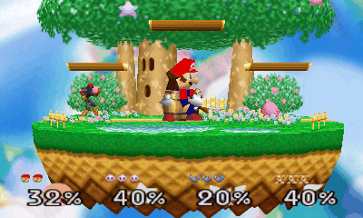
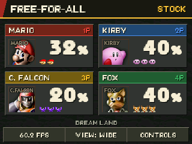

# Smash 64 for New Nintendo 3DS

A native port of **Super Smash Bros. for Nintendo 64** to homebrewed New Nintendo 3DS systems, built from the game's decompilation. The original game runs on the ARM11 CPU and renders through the PICA200 GPU, with stereoscopic 3D controlled by the console's 3D slider.

<table>
  <tr>
    <th>Stereoscopic gameplay</th>
    <th>Live match HUD</th>
  </tr>
  <tr>
    <td align="center"></td>
    <td align="center"></td>
  </tr>
</table>

*Captured in Azahar from v1.0.0. The wigglegram alternates both eyes of a single gameplay frame to preview the depth; on a 3DS, each eye sees its own view simultaneously.*

## Features

- Original single-player modes and Versus against CPU opponents.
- Full-height 4:3 gameplay, with optional widescreen that expands the camera view without stretching fighters.
- A bottom-screen HUD with character portraits, damage, stocks or scores, and a true-combo counter.
- Touch controls for display settings, FPS information, and control options.
- Optional **tap jump off** and **C-stick smash attacks / directional aerials**. X/Y jumping remains available.
- Saves, saved preferences, native audio, and bounded performance reports for troubleshooting.
- Two installable versions with separate saves: **Smash 64** (unlock things by playing, or import your N64 save) and **Smash 64: All Unlocked**.
- Rendering on the New 3DS's third CPU core, alongside the game, as the N64's graphics chip worked.

This port targets **New Nintendo 3DS and New Nintendo 3DS XL**. Original 3DS/2DS models are not supported. Local and wireless multiplayer are not implemented. Performance is optimized for the New 3DS; a locked 60 FPS is not guaranteed in every situation.

## Installation

This is a **source release**. You need your own **US 1.0 Super Smash Bros. ROM** (`.z64`, `.n64` or `.v64`) to build the CIA files; no ROM, extracted game assets, save files, or prebuilt game binaries are distributed here.

**Easiest (Windows):** download `Smash64-3DS-CIA-Builder-vX.Y.Z.zip` from [Releases](https://github.com/2gifts/smash64-3ds/releases), extract it, double-click **`Build Smash 64 CIA.bat`**, and choose your ROM. The first build downloads the pinned tools and takes 10–30 minutes; it produces both CIA files and explains the last steps. Developers can follow the [build guide](docs/BUILD-3DS.md) instead.

1. Copy `Smash64-New3DS.cia` and/or `Smash64-New3DS-Unlocked.cia` to the SD card in your homebrewed New 3DS.
2. Open **FBI**, select each CIA, and choose **Install CIA**.
3. Launch **Smash 64** from the HOME Menu and adjust the 3D slider to taste. The All Unlocked version's icon has an **ALL** badge.

For audio, `/3ds/dspfirm.cdc` must be present. Current Luma3DS provides a DSP firmware dump in **Rosalina → Miscellaneous options**. Use the firmware from your own console.

Saves, settings and reports live in `/3ds/ssb64/` (and `/3ds/ssb64-unlocked/` for All Unlocked). Updates keep the same title IDs and saves; back up these folders before updating. An optional N64 `.srm` save can be imported when building (build guide); otherwise Smash 64 starts with a fresh save. Exit with the HOME button.

The title IDs are `000400000FF64000` and `000400000FF64100`. Neither can replace Super Smash Bros. for Nintendo 3DS; CIA files built elsewhere may use other IDs and are not supported here.

## Controls

| Input | Action |
|---|---|
| Circle Pad | Move; tap up to jump when enabled |
| A / B | Attack / special |
| X or Y | Jump |
| L or R | Shield |
| ZL or ZR | Grab |
| D-pad Up | Taunt |
| Start | Pause |
| D-pad, on fighter select | Costume color (like the N64 C buttons) |
| C-stick, when enabled | Smash attack on the ground; directional aerial in the air |

Tap **CONTROLS** on the bottom screen to switch **TAP JUMP** between ON/OFF or **C-STICK** between OFF/SMASH. Defaults preserve the original controls: tap jump on, C-stick off. Return the nub to center between attacks. Options save automatically and apply to the built-in player controls.

Tap **VIEW** for 4:3/widescreen and **FPS** for performance details. Reports are saved automatically after each match and rotate through eight files in `/3ds/ssb64/perf/`; they do not accumulate per-frame logs indefinitely. The circle pad has a small deadzone so a resting stick does not drift.

## Building and contributing

The [Windows build guide](docs/BUILD-3DS.md) covers the toolchain and ROM requirements. The `3ds/` directory contains the platform code and build tools; the root `src/` directory contains the game code. Dependencies are pinned as Git submodules. Please do not submit ROMs, extracted assets, saves, firmware, or compiled game packages in issues or pull requests.

Bug reports are most useful with the console model, stage, fighters, display mode, 3D slider setting, and relevant performance report. Emulator results help reproduce bugs but do not establish console performance.

## Credits

- [ssb-decomp-re](https://github.com/VetriTheRetri/ssb-decomp-re) and its contributors for the original decompilation.
- [JRickey's BattleShip](https://github.com/JRickey/BattleShip) and its port-patches branch for the native engine, asset, and audio work this port builds on.
- [SM64 3DS graphics backend](https://github.com/mkst/sm64-port/tree/3ds-port), devkitPro, libctru, citro3d, and the 3DS homebrew community.

Component licenses and notices are retained in [3ds/licenses](3ds/licenses) and the upstream sources. The graphics backend permits source distribution, not binary redistribution; this repository therefore publishes source only. Original game and HOME Menu artwork belong to Nintendo / HAL Laboratory. This is an unofficial fan project, not affiliated with or endorsed by Nintendo.
